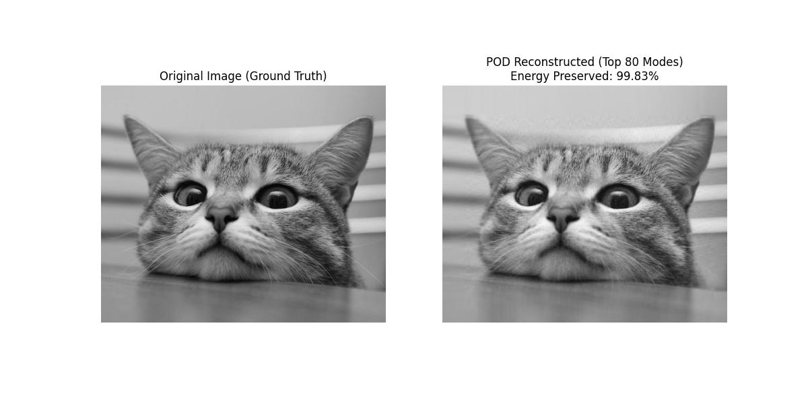
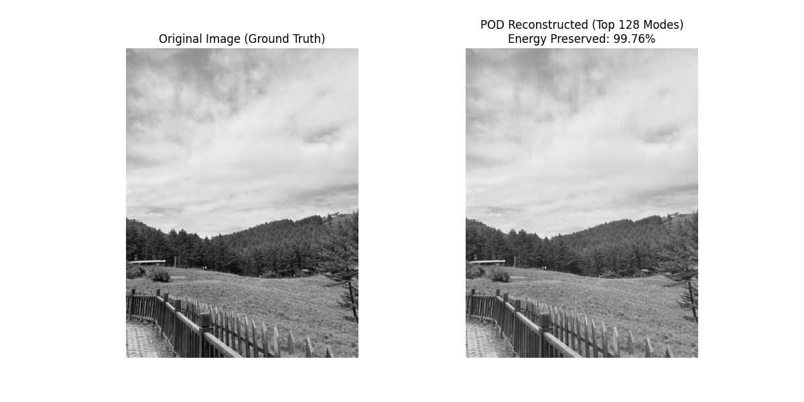

# CC-Quality-Prediction
**特殊钢大断面连铸在线质量预测系统**

## 1. 项目简介 (Project Overview)
本项目旨在基于 **POD (本征正交分解)** 和 **Transformer** 架构，构建连铸过程温度场的实时预测模型。通过“模型降阶+时序预测+数据同化”的闭环，解决传统有限元计算过慢的问题。

## 2. 本周进展 (Week 1 Progress)
- [x] **理论调研**：完成 POD 降阶原理与 Transformer 机制的学习。
- [x] **原理验证**：编写 SVD 降阶算法 Demo，验证了保留 10% 模态即可还原 99% 的信息。
- [x] **Baseline 选型**：确定采用 Time-Series-Library (Transformer) 作为基准模型。

## 3. Demo 效果展示
利用 POD 算法对模拟物理场（图像）进行压缩与重构：

*(上图为本周代码运行结果：左图为原始场，右图为 POD 重构场)*

## 4. 下周计划
- 接入 Time-Series-Library 进行基准测试。
- 处理连铸仿真数据（.csv 格式）。
